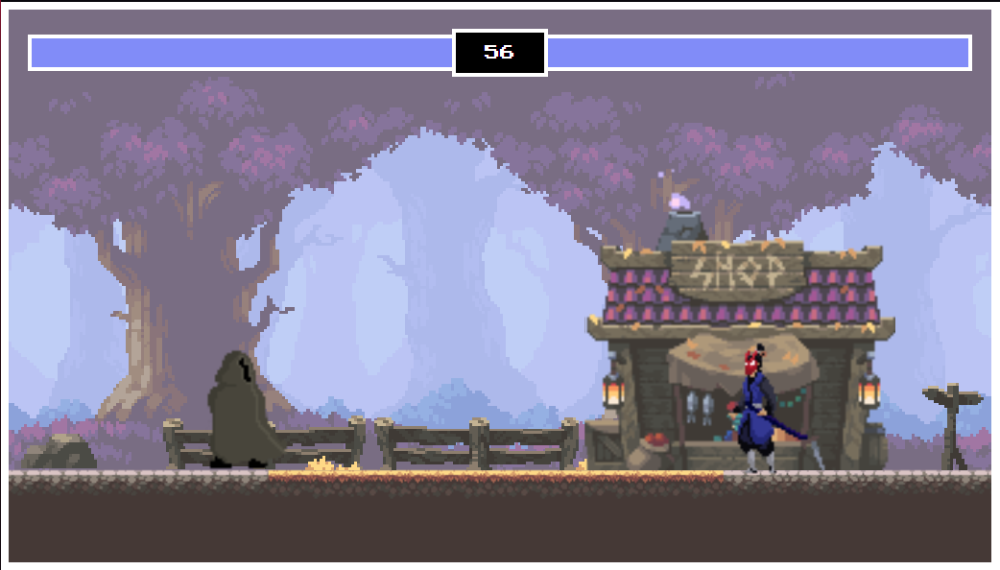

# 🎮 เกมต่อสู้ 2 มิติ (2D Fighting Game)

## 🖼️ ตัวอย่างหน้าจอเกม




---

## 🔍 ภาพรวม

เกมต่อสู้ 2 มิติพัฒนาโดยใช้ **HTML5, CSS, JavaScript**  
ใช้ **Canvas API** ในการเรนเดอร์ภาพ และ **GSAP** สำหรับการสร้างแอนิเมชัน  
ผู้เล่นสามารถควบคุมตัวละครต่อสู้กับศัตรูได้ พร้อมระบบแถบพลังชีวิตและจับเวลาการแข่งขัน

---

## ✨ คุณสมบัติหลัก

- แอนิเมชันหลากหลาย: ยืน, วิ่ง, กระโดด, โจมตี, โดนโจมตี, ตาย
- ระบบแถบพลังชีวิตแบบเรียลไทม์
- ตรวจจับการชนเพื่อให้การโจมตีมีผล
- ระบบนับถอยหลังเพื่อหาผู้ชนะ
- การควบคุมด้วยแป้นพิมพ์
- ภาพพื้นหลังและตัวละครแบบพิกเซลอาร์ต

---

## 🚀 วิธีติดตั้งและใช้งาน

1. โคลนโปรเจกต์:

   ```bash
   git clone https://github.com/yourusername/2d-fighting-game.git
   cd 2d-fighting-game
   ```

2. เปิด `index.html` ในเบราว์เซอร์:

   - คลิกขวา → Open with → เบราว์เซอร์ของคุณ
   - หรือเปิดผ่าน Live Server (ใน VS Code)

---

## 🎮 การควบคุม

| ผู้เล่น         | คีย์ |
|-----------------|------|
| เดินซ้าย        | `A`  |
| เดินขวา         | `D`  |
| กระโดด          | `W`  |
| โจมตี           | `Space` |

| ศัตรู (AI หรือผู้เล่น 2) | คีย์ |
|--------------------------|------|
| เดินซ้าย                | `←` |
| เดินขวา                 | `→` |
| กระโดด                  | `↑` |
| โจมตี                   | `↓` |

---

## 📦 เทคโนโลยีที่ใช้

- HTML5 Canvas API
- JavaScript (Vanilla)
- GSAP (สำหรับ Animation)
- CSS สำหรับตกแต่งฉาก

---

## 🙌 เครดิต

- **ผู้พัฒนา:** (Apirom Phumphung)


---

## 🪪 License

โครงการนี้อยู่ภายใต้ MIT License  
คุณสามารถคัดลอก แก้ไข หรือใช้เพื่อการศึกษาและพาณิชย์ได้อย่างอิสระ

---

